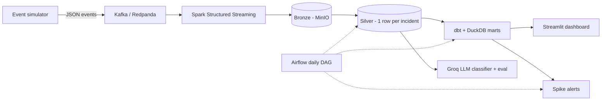
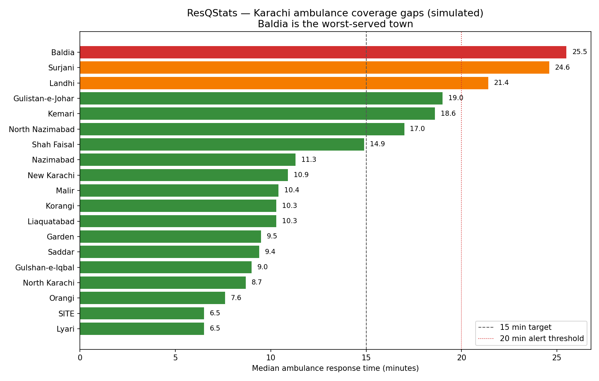

# ResQStats

**Dispatch analytics platform for Karachi's ambulance networks.**

Edhi and Chhipa run some of the world's largest volunteer ambulance fleets with
almost no data infrastructure. ResQStats simulates Karachi's emergency dispatch
operations (real dispatch data is confidential) and runs a production-grade
data platform on top — streaming ingestion, a medallion lakehouse, LLM call
classification, a tested warehouse, daily orchestration, and an interactive
dashboard. Built entirely with free tools.

## Architecture



Bronze = immutable raw events · Silver = clean incidents with durations ·
Gold = tested dbt marts.

## Findings



**Baldia is Karachi's worst-served town** — 25.5 min median response, 100% of
incidents waiting over 15 minutes. The daily pipeline detects and alerts on
this automatically:

```
[ALERT] ResQStats: degraded response times detected
- Baldia: median 25.5 min, 100.0% over 15 min
- Surjani: median 24.6 min, 66.7% over 15 min
- Landhi: median 21.4 min, 100.0% over 15 min
```

## LLM classification — measured

A free Llama model (Groq) extracts `{incident_type, severity}` from bilingual
call transcripts. Simulator ground truth makes accuracy measurable:

| Task | Accuracy | Why |
|---|---|---|
| incident_type | **100%** | Call texts carry a clear type signal |
| severity | **32%** | No severity signal exists in the text — the eval detected an unlearnable task |

The LLM only structures text; all metrics are computed in SQL/Python.

## Stack

Python · Kafka (Redpanda) · Spark Structured Streaming · MinIO (S3) · Parquet ·
DuckDB · dbt Core · Groq (Llama) · Airflow · Streamlit · Plotly · Docker
Compose · GitHub Actions · pydantic · pytest

## Run it

```bash
python -m venv .venv && .venv\Scripts\activate && pip install -r requirements.txt
pytest

docker compose up -d
python -m producers.simulator --seed 42 --hours 24 --sink kafka --bootstrap localhost:9092
docker compose --profile streaming up spark-bronze
docker compose --profile batch up spark-silver

cd transform && dbt build --profiles-dir . && cd ..
python -m enrichment.llm_classify --limit 100

docker compose --profile orchestration up airflow
streamlit run dashboard/app.py
```

Consoles: Kafka `:8080` · MinIO `:9001` · Airflow `:8081` (admin/admin) ·
Dashboard `:8501`. Groq key (free, console.groq.com) goes in `.env` — see
`.env.example`.

## Structure

| Folder | Contents |
|---|---|
| `producers/` | Event simulator, pydantic schemas, Karachi reference data |
| `streaming/` | Spark streaming bronze sink |
| `enrichment/` | Silver builder, LLM classifier, accuracy eval |
| `transform/` | dbt project — 6 models, 17 tests |
| `orchestration/` | Airflow DAG, alerting |
| `dashboard/` | Streamlit app, static HTML generator |
| `tests/` | 13 unit tests |

## Design decisions

- **Simulator over scraping** — confidential domain; gives unlimited labeled
  data and makes the LLM evaluable ([ADR-0001](docs/decisions/0001-simulator-over-scraping.md)).
- **Kafka/Spark at this volume is deliberate** — bursty emergencies fit
  streaming; replayable topics + immutable bronze allow full reprocessing.
- **DuckDB over Snowflake** — no trial expiry; dbt makes the swap a one-file
  profile change.

## License

MIT — simulated data only; no real patient or dispatch records.
